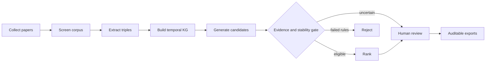

# ESV-Gap

**Evidence- and Stability-Validated Knowledge-Graph Research-Gap Triage**

ESV-Gap is a research prototype that collects scholarly metadata, screens a
topic-specific corpus, extracts evidence-linked knowledge triples, builds a
temporal knowledge graph, and routes structural gap signals through a
fail-closed validation gate before human review.

The system treats graph anomalies as **research-gap candidates**, not as proof
of scientific novelty. Candidates without sufficient provenance, independent
paths, perturbation stability, or corpus-closure evidence are sent to manual
review or rejected.

> Project status: research prototype for a student scientific-research
> submission. The reported expert review is author-internal and must not be
> interpreted as independent external validation.

## Main features

- Semantic Scholar collection with bounded retry and timeout behavior.
- Topic-conditioned abstract screening through a Groq-hosted LLM.
- Checkpointed triple extraction that can resume after quota exhaustion.
- Deterministic entity normalization and temporal knowledge-graph construction.
- Missing-link, orphan-community, and temporal-decay candidate generation.
- Fail-closed evidence and stability validation before score-based ranking.
- Human review ledger with Accept, Reject, Modify, and Pending decisions.
- B1 retrieval-augmented and B2 per-abstract LLM comparison workflows.
- Interactive Streamlit workbench with graph, analytics, review, and export tabs.
- Controlled validation benchmark and reproducibility utilities.

## Pipeline



The validation gate checks path-specific provenance, source-disjoint support,
entity specificity, robustness under graph perturbations, existing direct
links, and lexical evidence that the screened corpus may already cover the
candidate.

## Repository layout

```text
research-paper-gap/
|-- ESV-Gap/
|   |-- app.py                 # Streamlit evidence workbench
|   |-- config.yaml            # Pipeline and validation configuration
|   |-- run_pipeline.py        # Command-line stage runner
|   |-- requirements.txt       # Application dependencies
|   |-- tokens.css             # Streamlit visual design tokens
|   |-- src/                   # Collection, KG, detection, validation, scoring
|   |   `-- gap_provenance.py  # Gap-to-paper evidence tracing
|   |-- prompts/               # LLM prompt templates
|   |-- tests/                 # Offline regression tests
|   |-- experiments/           # Benchmark and reproducibility scripts
|   `-- paper_v2/              # LaTeX source, PDFs, results, review response
`-- README.md
```

Generated `runs/`, local release bundles, `.env`, and temporary outputs are
excluded from Git.

## Installation

Python 3.9 or newer is required. A virtual environment is recommended.

```powershell
git clone https://github.com/Khoa-Hoa-Technology-Solution-Company/research-paper-gap.git
cd research-paper-gap\ESV-Gap

python -m venv .venv
.\.venv\Scripts\Activate.ps1
python -m pip install --upgrade pip
pip install -r requirements.txt
python -m spacy download en_core_web_sm
```

Linux and macOS activation:

```bash
source .venv/bin/activate
```

Obtain a Groq API key from the Groq console. Either paste it into the protected
field in the interface or expose it only for the current shell:

```powershell
$env:GROQ_API_KEY="your-key-here"
```

Do not place a real key in `config.yaml` or commit it to Git. A Semantic Scholar
API key is optional; unauthenticated collection is supported with rate limits.

## Run the interface

From the project directory:

```powershell
streamlit run app.py
```

Open `http://127.0.0.1:8501`, enter a research topic and collection budget, and
select **Discover evidence gaps**. Each execution receives an isolated run
directory, so results from different topics are not silently mixed.

If Groq reports quota exhaustion during extraction, the completed paper files
and progress metadata remain checkpointed. Return later, provide a working API
key, and select **Resume extraction**. Collection and screening will not be
repeated, and already completed papers will be skipped.

## Run from the command line

Configure the topic and paths in `config.yaml`, then run the entire pipeline:

```powershell
python run_pipeline.py --stage all
```

Stages can also be executed individually and in order:

```powershell
python run_pipeline.py --stage collect
python run_pipeline.py --stage filter
python run_pipeline.py --stage extract
python run_pipeline.py --stage build
python run_pipeline.py --stage detect
python run_pipeline.py --stage validate
python run_pipeline.py --stage score
python run_pipeline.py --stage visualise
```

## Tests

The regression suite is offline and does not require an API key:

```powershell
python -m unittest discover -s tests -v
```

Current repository state: **30 tests passing**. The tests cover bounded network
retries, extraction checkpointing, dependency fallbacks, null-graph handling,
temporal zero-to-zero behavior, gap-to-paper provenance, validation semantics,
and the controlled benchmark's binary label mapping.

## Reported experiment snapshot

The corrected live run used the query `security of mongodb` with a collection
budget of 100 papers.

| Measure | Result |
|---|---:|
| Semantic Scholar records collected and screened | 74 |
| Papers retained | 53 |
| Extracted relation events | 643 |
| Knowledge-graph nodes / edges | 578 / 636 |
| Raw structural candidates | 128 |
| Review-required after the frozen gate | 9 |
| Rejected by the frozen gate | 119 |
| Automatically eligible | 0 |
| B1 TF-IDF RAG outputs | 53 |
| B2 per-abstract LLM outputs | 159 |
| Author-internal post-gate decisions | 8 Accept, 1 Reject |

The 8/9 author-internal acceptance count describes reviewer disposition on the
uncertainty-routed queue. It is **not** an estimate of precision, novelty, or
comparative effectiveness. B1 and B2 did not receive shared expert labels.

For exact hashes, protocol details, limitations, and offline commands, see the
[reproducibility record](./ESV-Gap/paper_v2/REPRODUCIBILITY.md).

## Paper

- [IEEE LaTeX source](./ESV-Gap/paper_v2/main_ieee.tex)
- [Compiled IEEE PDF](./ESV-Gap/paper_v2/main_ieee.pdf)
- [LNCS LaTeX source](./ESV-Gap/paper_v2/main.tex)
- [Experiment summary](./ESV-Gap/paper_v2/results_summary.json)
- [Response to reviewers](./ESV-Gap/paper_v2/RESPONSE_TO_REVIEWERS.md)

## Authors

- Hoa Anh Le
- Hoang Duc Nguyen
- Khoa Ly Van Phan
- Thanh Dinh Nguyen

Department of Information Technology, FPT University, Ho Chi Minh City Campus,
Vietnam.

Faculty Supervisor: **Long Truong**, Department of Software Engineering, FPT
University, Ho Chi Minh City Campus, Vietnam.

## Responsible use

ESV-Gap is intended to prioritize candidates for researcher inspection. A
candidate should not be reported as a confirmed research gap without reading
the underlying papers, checking full text and citation context, and obtaining
appropriate independent expert review.
