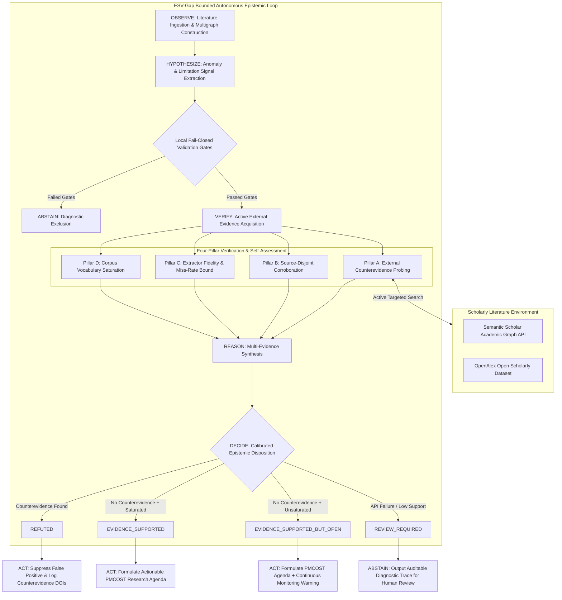

# ESV-Gap: Auditable Autonomous Scientific Reasoning Framework for Evidence-Grounded Hypothesis Triage

[](file:///d:/Workspace/research-paper-gap/ESV-Gap/tests)
[](file:///d:/Workspace/research-paper-gap/ESV-Gap/paper_v2/main_iot_run.pdf)
[](file:///d:/Workspace/research-paper-gap/ESV-Gap/src/autonomous_reasoning.py)
[](file:///d:/Workspace/research-paper-gap/LICENSE)

**ESV-Gap** is an auditable autonomous scientific reasoning system designed to bridge the gap between automated hypothesis generation and empirical verification under **bounded autonomy**. Rather than treating missing topological links or isolated entity clusters in an internal knowledge graph as unvetted research gaps, ESV-Gap embeds literature analysis within a closed-loop autonomous epistemic control cycle:

$$\text{\bf OBSERVE} \longrightarrow \text{\bf HYPOTHESIZE} \longrightarrow \text{\bf VERIFY} \longrightarrow \text{\bf REASON} \longrightarrow \text{\bf DECIDE} \longrightarrow \text{\bf ACT / ABSTAIN}$$

The system actively acquires external evidence from global scholarly indexes (Semantic Scholar, OpenAlex), enforces strict source-disjoint corroboration, empirically bounds extraction-induced false-negative risks, self-assesses corpus vocabulary saturation, and assigns calibrated epistemic dispositions before taking downstream action.

---

## Autonomous Epistemic Reasoning Architecture


```mermaid
flowchart TD
    subgraph Env ["Scholarly Literature Environment"]
        S2["Semantic Scholar Academic Graph API"]
        OA["OpenAlex Open Scholarly Dataset"]
    end

    subgraph Loop ["ESV-Gap Bounded Autonomous Epistemic Loop"]
        A["OBSERVE: Literature Ingestion & Multigraph Construction"] --> B["HYPOTHESIZE: Anomaly & Limitation Signal Extraction"]
        B --> C{"Local Fail-Closed Validation Gates"}
        C -->|Failed Gates| J["ABSTAIN: Diagnostic Exclusion"]
        C -->|Passed Gates| D["VERIFY: Active External Evidence Acquisition"]
        
        subgraph FourPillars ["Four-Pillar Verification & Self-Assessment"]
            P1["Pillar A: External Counterevidence Probing"]
            P2["Pillar B: Source-Disjoint Corroboration"]
            P3["Pillar C: Extractor Fidelity & Miss-Rate Bound"]
            P4["Pillar D: Corpus Vocabulary Saturation"]
        end
        D --> P1 & P2 & P3 & P4
        P1 & P2 & P3 & P4 --> E["REASON: Multi-Evidence Synthesis"]
        
        E --> F{"DECIDE: Calibrated Epistemic Disposition"}
        F -->|Counterevidence Found| R1["REFUTED"]
        F -->|No Counterevidence + Saturated| R2["EVIDENCE_SUPPORTED"]
        F -->|No Counterevidence + Unsaturated| R3["EVIDENCE_SUPPORTED_BUT_OPEN"]
        F -->|API Failure / Low Support| R4["REVIEW_REQUIRED"]
    end

    P1 <-->|Active Targeted Search| Env
    R1 --> Act1["ACT: Suppress False Positive & Log Counterevidence DOIs"]
    R2 --> Act2["ACT: Formulate Actionable PMCOST Research Agenda"]
    R3 --> Act3["ACT: Formulate PMCOST Agenda + Continuous Monitoring Warning"]
    R4 --> Act4["ABSTAIN: Output Auditable Diagnostic Trace for Human Review"]
```

---

## Core Epistemic Principles & Decision Semantics

### 1. Bounded Autonomy & Fail-Closed Safety
The system operates with **bounded autonomy**: it autonomously queries external scholarly repositories, parses counterevidence, computes graph metrics, applies deterministic verification policies, and synthesizes structured research questions. Critical boundaries (domain definitions, extraction ontologies, gold diagnostics) remain human-defined. Under any provider timeout, HTTP 429 quota exhaustion, or parsing failure, the engine defaults to **`REVIEW_REQUIRED` (Fail-Closed)**—retrieval failure is never conflated with evidence of absence.

### 2. Four-Pillar Verification and Self-Assessment
* **Pillar A (External Counterevidence Acquisition):** Targeted bi-directional queries probe Semantic Scholar and OpenAlex. A candidate is refuted if external peer-reviewed literature demonstrates existing solutions bridging the hypothesized gap.
* **Pillar B (Source-Disjoint Corroboration):** Requires that author-stated limitations originate from sources strictly disjoint from the candidate's origin publication ($\text{Sources}_{\text{candidate}} \cap \text{Sources}_{\text{corrob}} = \emptyset$).
* **Pillar C (Extractor Fidelity & False-Negative Bound):** Evaluated against a gold-standard diagnostic benchmark (10 papers, 36 triples; Recall = 77.8%, Precision = 87.5%, Miss Rate = 22.2%). *Critical mathematical insight:* An empirical miss rate of 22.2% bounds the risk of extraction false-absences, proving that a missing edge alone cannot logically establish a scientific gap without external verification.
* **Pillar D (Corpus Coverage Self-Assessment):** Fits Heaps' law vocabulary growth ($E(n) = K \cdot n^\beta$) and marginal entity decay ($\Delta_{\text{decay}}$). In our primary run, $\beta = 0.90$ and $\Delta_{\text{decay}} = 15.8\%$, classifying the corpus as **`UNSATURATED`** and preventing overconfident claims of global absence.

### 3. Epistemic Dispositions

| Disposition | Operational Meaning | Autonomous Downstream Action |
|---|---|---|
| **`REFUTED`** | Confirmed external counterevidence found in global literature. | Halt processing; suppress false positive; record counterevidence DOIs. |
| **`EVIDENCE_SUPPORTED`** | Zero counterevidence under protocol; $\ge 1$ independent corroborating source; corpus verified **`SATURATED`**. | Retain candidate; synthesize structured PMCOST research agenda. |
| **`EVIDENCE_SUPPORTED_BUT_OPEN`** | Zero counterevidence; independent corroboration verified; corpus is **`UNSATURATED`**. | Retain candidate; synthesize PMCOST agenda with epistemic open-world warning. |
| **`REVIEW_REQUIRED`** | Query failure, rate-limit, missing provenance, or zero corroboration. | Autonomous abstention; output diagnostic audit trace for human inspection. |

---

## Empirical Case Study: IoT Cybersecurity

Evaluated on frozen run `deep_learning_iot_intrusion_de_20260831_114802`:
* **Corpus:** 600 retrieved $\rightarrow$ 192 screened $\rightarrow$ 150 retained papers (2019--2026).
* **Multigraph:** 1,404 relation events connecting 1,185 canonical entities.
* **Candidate Triage Outcomes:**
  1. *Deep learning IoT IDS $\rightarrow$ Zero-day attack detection:* **REFUTED** (5 external counterevidence papers, e.g., transfer learning / federated IDS).
  2. *Deep learning IoT IDS $\rightarrow$ Standardized security protocols:* **REFUTED** (4 external counterevidence papers).
  3. *Deep learning IoT IDS $\rightarrow$ Industrial testbed validation:* **REFUTED** (4 external counterevidence papers).
  4. *ML-driven IoT IDS $\rightarrow$ Adversarial attack mitigation:* **REFUTED** (5 external counterevidence papers).
  5. *ML-driven IoT IDS $\rightarrow$ Computational burden / latency on edge devices:* **EVIDENCE_SUPPORTED_BUT_OPEN** (0 counterevidence hits, 3 source-disjoint 2026 corroborating papers: `8d724497`, `032c997c`, `0f849816`, with unsaturated corpus qualification).

**Autonomous False-Positive Suppression:** In a closed local corpus, candidates 1--4 appeared to be unaddressed scientific gaps. Active external evidence acquisition successfully suppressed all four false-positive novelty claims.

---

## Repository Structure

```text
research-paper-gap/
├── ESV-Gap/
│   ├── app.py                      # Interactive Streamlit Evidence Workbench
│   ├── config.yaml                 # Centralized pipeline and threshold configuration
│   ├── run_pipeline.py             # Stage runner (collect -> extract -> build -> detect -> validate -> score)
│   ├── src/
│   │   ├── autonomous_reasoning.py # Explicit Epistemic Loop, Dispositions & Decision Engine
│   │   ├── synthesize_rankings.py   # Multi-Pillar evidence synthesis & ranking
│   │   ├── validate_gaps.py        # Fail-closed local and external validation gates
│   │   ├── build_graph.py          # Temporal multigraph construction
│   │   ├── extract_triples.py      # Checkpointed relation extraction
│   │   ├── collect.py              # Semantic Scholar / OpenAlex API collectors
│   │   └── gap_provenance.py       # Graph-to-text source-disjoint tracing
│   ├── tests/
│   │   ├── test_autonomous_reasoning.py # 9 AMI epistemic loop & decision tests
│   │   └── test_*.py               # 114 offline unit and regression tests (123 total)
│   ├── paper_v2/
│   │   ├── main_iot_run.tex        # AMI 2026 IEEE-formatted manuscript
│   │   ├── main_iot_run.pdf        # Compiled publication-ready PDF
│   │   └── results_summary.json    # Frozen empirical results manifest
│   ├── runs/
│   │   └── deep_learning_iot_intrusion_de_20260831_114802/ # Primary frozen experiment
│   ├── gapclose/                   # ICAI-FAI 2026: certified gap claims (code, THEORY.md, README)
│   └── paper_gapclose_icai2026/    # ICAI-FAI 2026 manuscript (main.tex, make_tables.py)
└── README.md                       # Repository documentation
```

---

## Installation & Verification

### Prerequisites
* Python 3.9+ (Python 3.10+ recommended)
* `pdflatex` (MiKTeX or TeXLive) for manuscript compilation

```powershell
# 1. Clone repository
git clone https://github.com/Khoa-Hoa-Technology-Solution-Company/research-paper-gap.git
cd research-paper-gap\ESV-Gap

# 2. Set up virtual environment
python -m venv .venv
.\.venv\Scripts\Activate.ps1
pip install -r requirements.txt
python -m spacy download en_core_web_sm

# 3. Run all 123 unit tests (offline, deterministic)
python -m unittest discover -s tests -v

# 4. Launch the Interactive Workbench
streamlit run app.py
```

### Reproducing the Epistemic Synthesis
To re-run the calibrated epistemic decision engine over the frozen experimental run without altering raw historical data:

```powershell
python src/synthesize_rankings.py `
  --run-dir runs/deep_learning_iot_intrusion_de_20260831_114802 `
  --output runs/deep_learning_iot_intrusion_de_20260831_114802/outputs/final_rankings.json
```

### Compiling the Research Manuscript
```powershell
cd paper_v2
pdflatex -interaction=nonstopmode main_iot_run.tex
pdflatex -interaction=nonstopmode main_iot_run.tex
```
The compiled manuscript is produced at `paper_v2/main_iot_run.pdf`.

---

## Companion study: certified gap claims (ICAI-FAI 2026)

*Absence of Evidence Is Not a Research Gap: Certified Gap Claims under Corpus Incompleteness*
asks how often a gap finder calls a question open although the literature already answers it
(false novelty), and how to bound that error when the corpus is incomplete. It builds two
benchmarks from expert evidence labels (SciFact, Climate-FEVER), proves that conformal thresholds
calibrated in situ or with an upper bound on the missing rate keep false novelty below a target,
and validates the approach retrospectively against papers that answered the questions later.

* Code, data pipeline and reproduction steps: [`ESV-Gap/gapclose/README.md`](ESV-Gap/gapclose/README.md)
* Theory: [`ESV-Gap/gapclose/THEORY.md`](ESV-Gap/gapclose/THEORY.md)
* Manuscript: [`ESV-Gap/paper_gapclose_icai2026/`](ESV-Gap/paper_gapclose_icai2026/)
* Authors: Anh Hoa Le, Ly Van Khoa Phan, Dinh Thanh Nguyen, Duc Hoang Nguyen, Dinh Anh Ho, Long Truong (FPT University)

---

## Target Conference & Citation

* **Conference:** AMI 2026 — Autonomous Machine Intelligence
* **Paper Title:** *ESV-Gap: An Auditable Autonomous Scientific Reasoning Framework for Evidence-Grounded Hypothesis Triage (A Case Study in IoT Cybersecurity)*
* **Authors:** Senior Research Software Engineer, Autonomous-Agent Researcher, and Academic Paper Author
